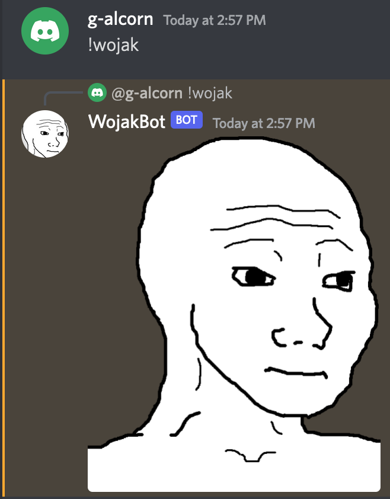

# WojakBot

WojakBot is a Discord bot who sends memes upon request. Made for personal use in small Discord servers.
Updated 25 April 2022

## Example commands

### Formatting

- !wojak - send the original Wojak
- !wojak \[category\] - send the default Wojak from the chosen category
- !wojak \[category\] \[style\] - send the specific Wojak from within the chosen category

### List of categories and specific Wojaks

- Wojak: [
    'default',  'joker',     'unsc',
    'sonic',    'drive',     'direct',
    'chief',    'rainy',     '3d',
    'bed',      'surprise',  'beard',
    'balloon',   'chair',     'happy',
    'abstract', 'fibonacci', 'computer',
    'engraved', 'scream',    'iq',
    'crying',   'yeshoney',  'smug'
  ]

- Soy: [ 'default', 'long', 'teeth', 'smiling', 'point' ]

- Doomer: [ 'default', 'cigarette', 'girl', 'black', 'hair' ]

- Chad: [ 'default', 'map', 'chin', 'wojak' ]

- Yeschad: [ 'default', 'nobeard' ]

- Shroom: [ 'default', 'other' ]

## Updates to come

- Debouncing repeated requests
- Option for random image
- Convert to slash commands potentially
